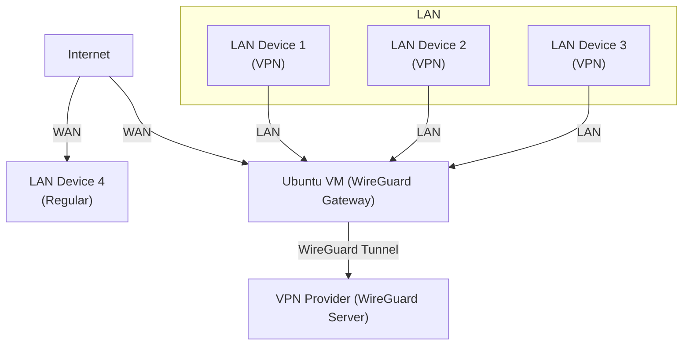

# VM VPN Gateway

> **Interactive, secure VPN gateway installer for Ubuntu VMs, using WireGuard.**
> All LAN network traffic routes via your commercial VPN.

---

## Features

- **Full Interactive Setup**
  Easily transforms any Ubuntu minimal server VM (20.04+, 22.04+) into a VPN LAN router.

- **Automatic Network Detection**
  Auto-selects and verifies WAN/LAN interfaces (manual override supported).
  
- **WireGuard Support**
  Installs, activates, and securely configures WireGuard from your `.conf` file.
  
- **Persistent IP Forwarding & NAT**
  Configures system routing and firewall, saving NAT rules on reboot.
  
- **User Feedback & Error Handling**
  Live status message, summary confirmation.
  
- **Troubleshooting & Verification Commands Provided**

---

## Requirements

- Ubuntu 20.04+ or 22.04+ Minimal Server (VM recommended)
- sudo/root access
- Comercial WireGuard compatible VPN subscription with a valid `.conf` file
- At least two NICs (one WAN, one LAN) recommended

---

## Quick Start

```.sh
git clone https://github.com/Nathan-Bransby-NMT/vm-vpn-gateway.git
cd vm-vpn-gateway
chmod +x vm-vpn-gateway-setup.sh
sudo ./vm-vpn-gateway-setup.sh
```

> [!IMPORTANT] 
> *Follow the interactive prompts: place your WireGuard config in `/etc/wireguard/` when prompted, select WAN/LAN interfaces and confirm your settings.*

---

## Advanced Usage

- **Config File:**
  - Supports any WireGuard `.conf` from providers like ProtonVPN, Mullvad, etc.
  - Place file in `/etc/wireguard/` and choose during script run.
    
- **Network Customisation:**
  - Manual override of detected network interfaces.
  - Optionally edit your WireGuard config for advanced routing or DNS.

---

## Network Topocology Example



---

## Verification & Troubleshooting

```.sh
sudo wg                                # WireGuard tunnel status
sudo iptables -t nat -L -v             # NAT rules
cat /proc/sys/net/ipv4/ip_forward      # Should return '1'
```

**Common Issues:**
- Interface names not detected? Check `ip link show`.
- Tunnel won't start? Validate your config file and VPN subscription.
- LAN devices can't route? Verify gateway assignment and that NAT is applied.

> [!TIP] 
> ### Still Can't Find What You're Looking For?
> Try these:
> - [WireGuard Documentation](https://www.wireguard.com/documentation/)
> - [Ubuntu Server Guide](https://ubuntu.com/server/docs)
> - [WireGuard Tools & Commands](https://www.wireguard.com/quickstart/)
> - [Iptables & Routing Primer](https://help.ubuntu.com/community/IptablesHowTo)
> 
> If you still require help, feel free to [open an issue](https://github.com/Nathan-Bransby-NMT/vm-vpn-gateway/issues).

---

## FAQ
<table>
  <tr>
    <td>
      <details>
        <summary><b><ins>Q:</ins> Does this work with any WireGuard VPN provider?</b></summary>
        <br>
        <table>
          <tr><td><ins>A:</ins> Yes, As long as you have a valid <code>.conf</code> file and credentials.</td></tr>
        </table>
      </details>
    </td>
  </tr>
  <tr>
    <td>
      <details>
        <summary><b><ins>Q:</ins> What if my LAN devices can't connect to the Internet?</b></summary>
        <br>
        <table>
          <tr><td><ins>A:</ins> Check that their gateway is set to the VM LAN IP, and NAT/forwarding is active (see verification commands).</td></tr>
        </table>
      </details>
    </td>
  </tr>
  <tr>
    <td>
      <details>
        <summary><b><ins>Q:</ins> Can I use this on my physical hardware, not VMs?</b></summary>
        <br>
        <table>
          <tr><td><ins>A:</ins> Yes, but the script is intended for Ubuntu minimal server installs—tested on VMs for flexibility.</td></tr>
        </table>
      </details>
    </td>
  </tr>
  <tr>
    <td>
      <details>
        <summary><b><ins>Q:</ins> How do I add more advanced WireGuard options?</b></summary>
        <br>
        <table>
          <tr><td><ins>A:</ins> Edit your <code>.conf</code> before starting the installer, or see WireGuard docs for custom routes, DNS, or allowed IP settings.</td></tr>
        </table>
      </details>
    </td>
  </tr>
</table>

---

## License

Distributed under the [AGPL-3.0 License](LICENSE).

---

## Contributing

Issues and PRs are welcome. Please submit improvements or bug reports directly through GitHub.

---

## Author

Nathan Bransby [open-source@nlb-software.dev]
  
<!--to transform any VM running Ubuntu (20.04+/22.04+) minimal server into a secure VPN router/gateway  - Ensuring that all connected LAN traffic on the network route through a WireGuard compatible VPN server.-->
